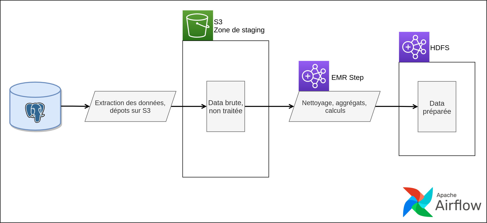

# 5DATA - Conception d'une plateforme d'ingénierie des données

Implémentation du projet final de 5DATA, l'objectif est de fournir un POC de plateforme de data engineering afin de permettre à Supinfo de centraliser et exploiter les données produites au travers de ses activités.


### Périmètre

_Le rendu écris comportant l'analyse fonctionnelle complète ainsi que les choix technologiques est disponible sous [5DATA-rendu.pdf](5DATA-rendu.pdf)._

La solution doit permettre aux métiers (Data Analyst, Data Scientists) d'analyser les données hétérogènes massives en provenance de différents systèmes de production, sans les impacter.

Elle doit aussi permettre aux équipes techniques (Data Engineers, exploitation) d'industrialiser l'intégration et le traitement des données.

Pour cela, nous proposons le déploiement d'une architecture comportant :
- une zone de staging, ou les données brut en provenance des différents système sont déposé, avant d'être traitées
- une zone de présentation : un Data Warehouse ou les données traitées sont intégrées
- des flux ETL afin d'intégrer les données entre les différentes zones
- un ordonnanceur, afin de définir, et industrialiser des workflow complexes de traitements
- des outils de visualisation, d'analyse, afin de permettre aux métiers d'accéder aux données

Afin d'illuster un cas d'ussage, nous considérons que les données issues de l'activité de Supinfo sont stockées dans un ERP.


### Déploiement

##### Prérequis

- Terraform > 0.12
- Un compte AWS
- [AWS CLI](https://docs.aws.amazon.com/cli/latest/userguide/cli-chap-install.html)
- Les credentials AWS configurés localement

##### Préparation de l'environnement

Via AWS CLI, génerer les [rôles de service EMR](https://docs.aws.amazon.com/cli/latest/reference/emr/create-default-roles.html) par défaut.

```
aws emr create-default-roles
```


Puis renseigner les variables suivantes dans un fichier `terraform.tfvars`, ou via des variables d'environnement Terraform `TF_VAR_<nom-de-la-variable>`.

- __key_name__ : le nom de la paire de clés qui sera associés aux instances EC2, celle-ci doit être paramétrée sur le service EC2 dans la région eu-west-1 (Irlande)
- __key_path__ : le chemin de la clé SSH pour se connecter aux instances EC2
- __docker_username__ : l’identifiant de compte Docker pour permettre à l’instance EC2 principale de télécharger les images Docker
- __docker_password__ : le mot de passe du compte Docker
- __bucket_name__ : le nom du bucket S3 qui sera créé pour la zone de staging, le dépot des jobs Spark, les logs d'EMR. Celui-ci doit respecter les [conventions de nommages](https://docs.aws.amazon.com/AmazonS3/latest/dev/BucketRestrictions.html) de S3
- __emr_service_role__ : l’ARN du rôle de service EMR par défaut créé précédemment
- __emr_instance_profile__ : l’ARN du profile d’instance pour les instances EC2 du cluster EMR créé précédemment

##### Déploiement de la stack

dans le répertoire `terraform` exécuter:

```
terraform init
terraform apply
```

##### Déploiement de la zone de présentation

Une fois la stack Terraform déployée, se connecter via SSH à l'instance du cluster emr via le use `hadoop`.
Copier les scripts d'initialisation depuis le répertoire `EMR` du bucket S3 créé.
```
aws s3 cp s3://$bucket/EMR/ . --recursive
```
Rendre le script de création des répertoires HDFS exécutable, puis le lancer avec le paramètres `-e` pour spécifier l'environnement (dev, prod...), `-b` pour le nom du bucket S3.
```
chmod +x 0_mkdirs_hdfs.sh
./0_mkdirs_hdfs.sh -e $env -b $bucket
```

Executer les scripts DDL Hive via `beeline` en spécifiant le même environnement pour créer la base, et les tables qui pointent vers le répertoires HDFS créés.
```
for i in 1_ddl_db.sql 2_ddl_tables.sql; do beeline -u jdbc:hive2://localhost:10000 --hiveconf env=$env -f $ddl; done
```

### Architecture

La stack Terraform déploie :

- Un Virtual Private Cloud (VPC) situé dans la région eu-west-1 (Irlande)
- Un sous-réseau accessible via internet dans la zone de de disponibilité (AZ) A
- Une instance EC2 t2.small exécutant l’ERP et l’ordonnanceur via Docker
- Un cluster single node Elastic Map Reduce (EMR) exécutant Hadoop, Spark, Hive, Hue
- Des Security Groups restreignant l'accès aux instances uniquement à l'IP depuis laquelle la stack a été déployée 
- Un Bucket S3
- Divers composants réseau et sécurité tel que l’Internet Gateway, table de routage, rôles de service et d'instance IAM

Elle provisionne aussi l'instance EC2, et le Bucket S3 :
- Installation et configuration de Docker
- Lancement des containers `postgres:alpine` et `puckel/docker-airflow`
- Peuplement de la base Postgres avec les données contenues dans `data/output/`
- Envois du DAG au container Airflow, paramétrage de la connection à Postgres, du nom du bucket S3
- Copie des scripts d'initialisation du DWH et du job Spark sur le Bucket S3


### Flux ETL

Afin d'illuster un cas d'usage de la plateforme, nous avons implémenté un flux ETL. Celui-ci :
- Décharge les données depuis l'ERP vers la zone de staging (Bucket S3, répertoire `stage/`) sous forme de fichiers CSV
- Puis transfert les données de la zone de staging vers la zone de présentation (Tables Hive) via une [Step EMR](https://docs.aws.amazon.com/emr/latest/ManagementGuide/emr-overview.html#emr-work-cluster) (Job Spark) qui calcul les moyennes et taux de présences des étudiants.



##### Lancer le flux

Le DAG ainsi que ses dépendances est copié sur le container lors du provisionnemnet de l'architecture. Pour l'éxecuter, se rendre sur le port `8080` de l'instance EC2.
Dans le menu __"Admin > Variables"__, configurer la variable `emr_cluster_id` et renseigner l'ID du cluster EMR afin de permettre au DAG de soumettre des Steps EMR au cluster.
Puis se rendre dans le menu __"DAG"__, et le lancer via __"Trigger DAG"__.
