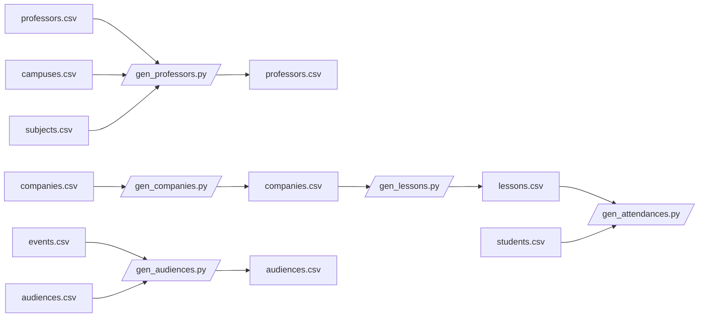

```mermaid
graph LR

audin[audiences.csv]
comin[companies.csv]
proin[professors.csv]
camin[campuses.csv]
evein[events.csv]
subin[subjects.csv]
stuin[students.csv]

gat[/gen_attendances.py/]
gau[/gen_audiences.py/]
gco[/gen_companies.py/]
gle[/gen_lessons.py/]
gpr[/gen_professors.py/]

proout[professors.csv]
comout[companies.csv]
audout[audiences.csv]
lesout[lessons.csv]

proin-->gpr
camin-->gpr
subin-->gpr
gpr-->proout

comin-->gco-->comout-->gle-->lesout
lesout-->gat
stuin-->gat

evein-->gau
audin-->gau-->audout
```